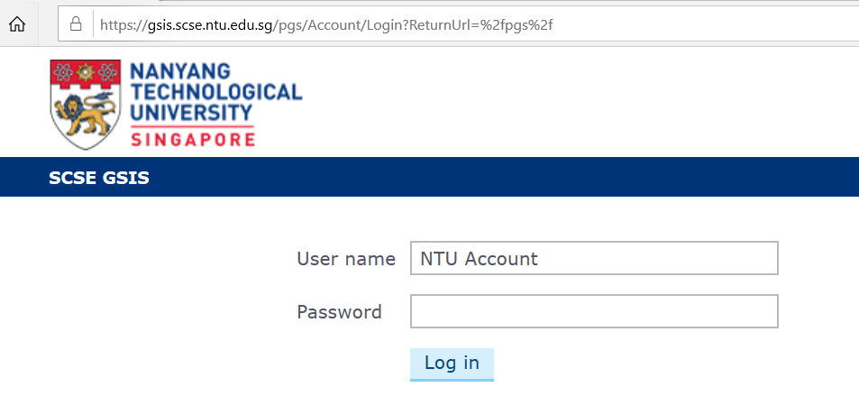
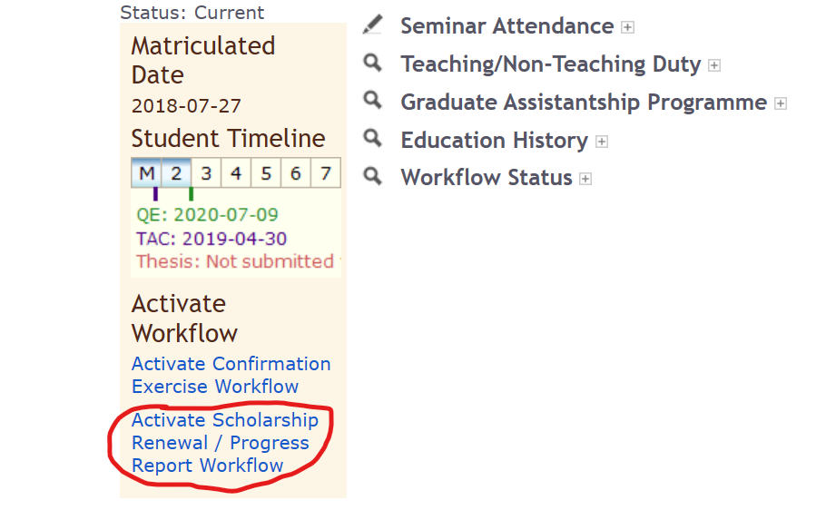
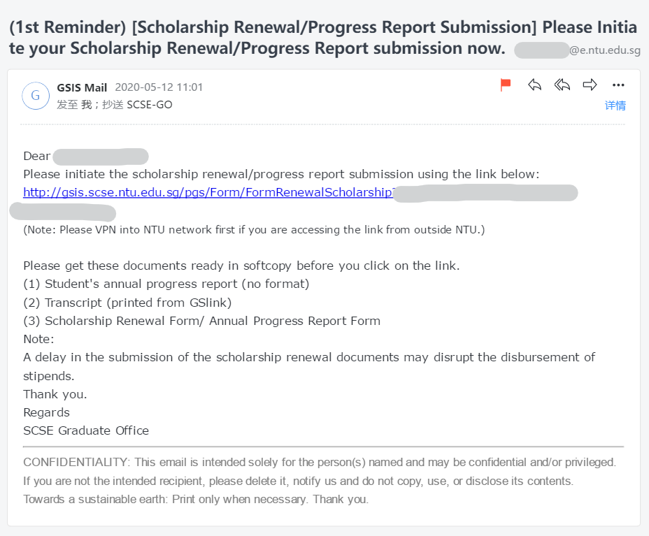
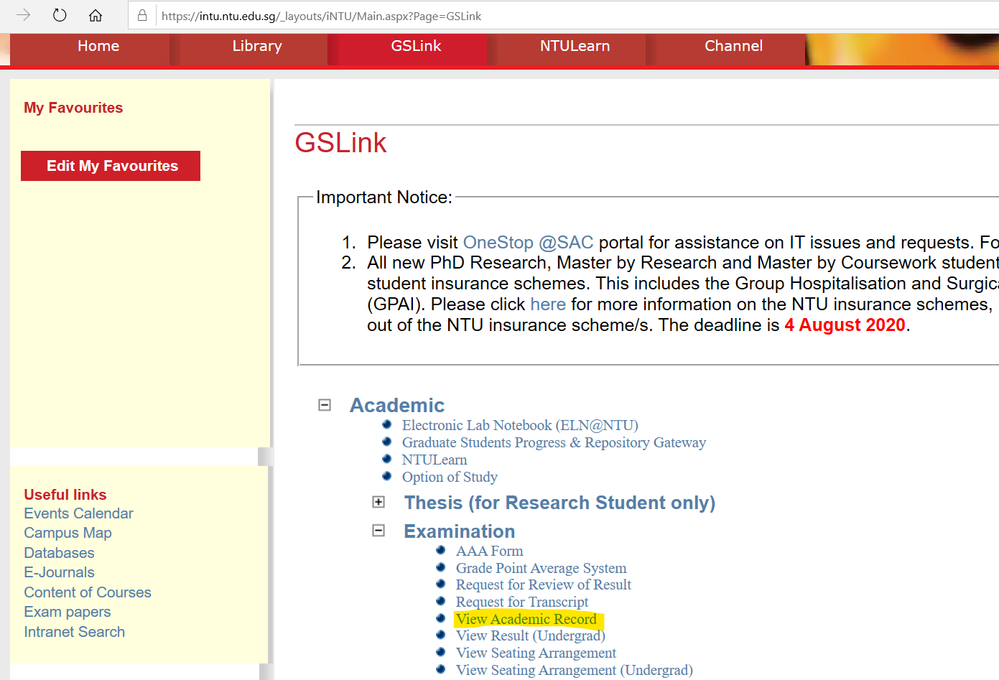
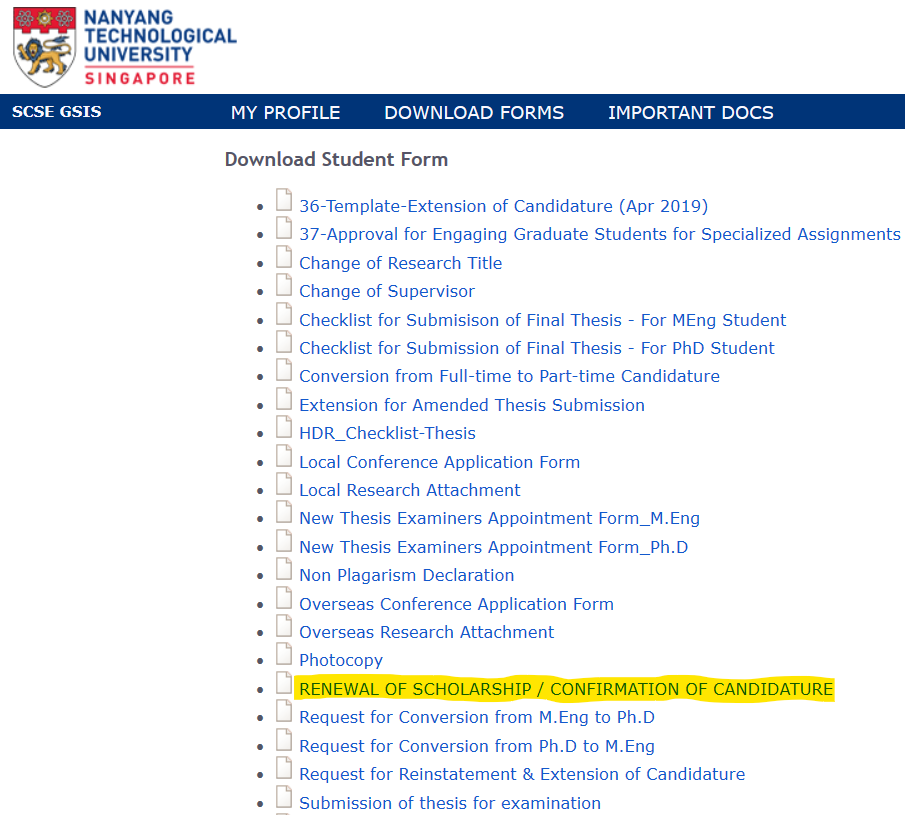
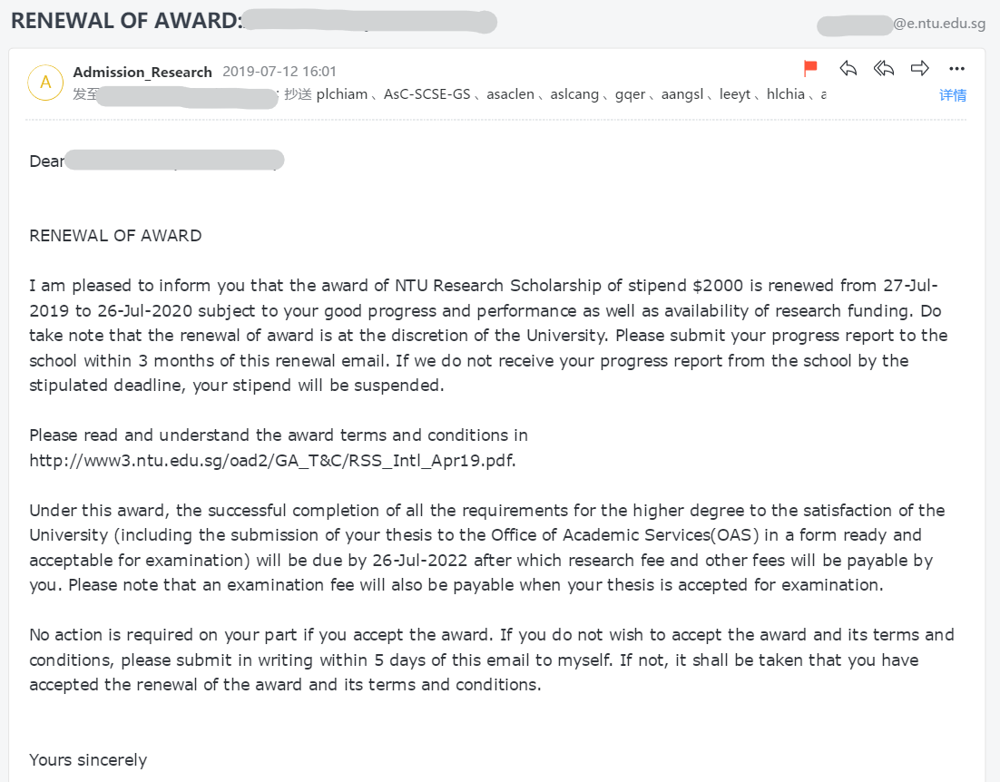

Guidelines for Scholarship Renewal / Annual Progress Report in NTU SCSE
=======================================================================

 [toc]

Preliminaries
-------------

### When? 

-   Before the end of the academic year.

-   Deadline: All the workflows should finish before the scholarship expire
    (Late July).

-   Advice: Start the Scholarship Renewal / Annual Progress Report workflow in
    May or June.

### Where?

- On the SCSE [Graduate Student Information System (GSIS)](https://gsis.scse.ntu.edu.sg/pgs/Account/Login?ReturnUrl=%2fpgs%2f). 

### Conditions

- Have attended at least 10 academic seminars in this academic year. 
- Meet the GPA requirement: CGPA >= 3.5, TGPA >= 3.5, single course GPA >= 3.0.
- First year students **may** need to finish other courses or seminars like ERI701, HWG703, Research Data Management Seminar, etc.

## Workflow

### Activate the Scholarship Renewal / Annual Progress Report workflow.

- Login to your [GSIS](https://gsis.scse.ntu.edu.sg/pgs/Account/Login?ReturnUrl=%2fpgs%2f) using your NTU account.

- Click the link: Activate the Scholarship Renewal / Annual Progress Report workflow

### Upload the supporting documents

- You will receive an e-mail from the system, which will provide you the link to upload the following documents

- Doc 1: Annual Progress Report.

There is no format requirement, so you can use an IEEE/ACM conference/journal template to write the report. 

The report is only about your research progress, so don't write contents other than your research. 

You can put literature reviews, your published papers and/or current works inside the progress report.

Neither be too short nor too long. Personally I recommend to write 10-30 pages.  

- Doc 2: Transcript from [iNTU GSLink](https://intu.ntu.edu.sg/_forms/default.aspx?ReturnUrl=/_layouts/Authenticate.aspx?Source=%2F&Source=/&)

Click into the "View Academic Record" and print the web page into a PDF

- Doc 3: Scholarship Renewal Form on GSIS.

Download the form on GSIS and fill in the form.

- Upload the PDF version of the documents to the link provided in the e-mail.
- There will be **three reminder E-mails** sent to you whose interval is one week. If you missed the submission deadline, you may need to re-activate it and/or explain the reasons to your supervisor and Graduate Office. 

### Your supervisor agrees your scholarship renewal on the teacher system

- Usually we don't need to remind our supervisors about this if your supervisor know that you are going through this scholarship renewal.
- If you don't receive the e-mail notification of successful renewal, please send an-email to ask the Graduate Office about the progress. Sometimes it may be delayed at your supervisor side and you have to remind your supervisor. 

### The Graduate Office checks the documents and requirements

- After all, you will receive an e-mail talking about your scholarship renewal.

 
